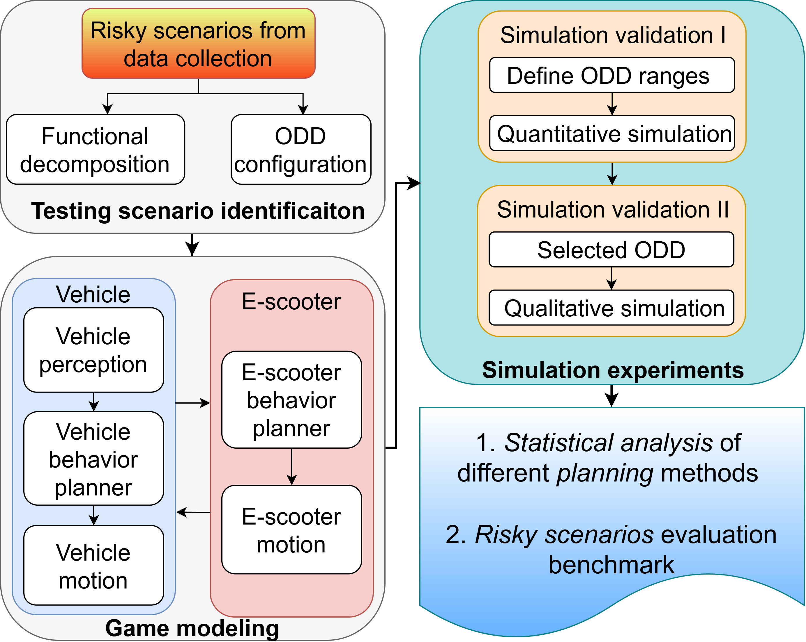
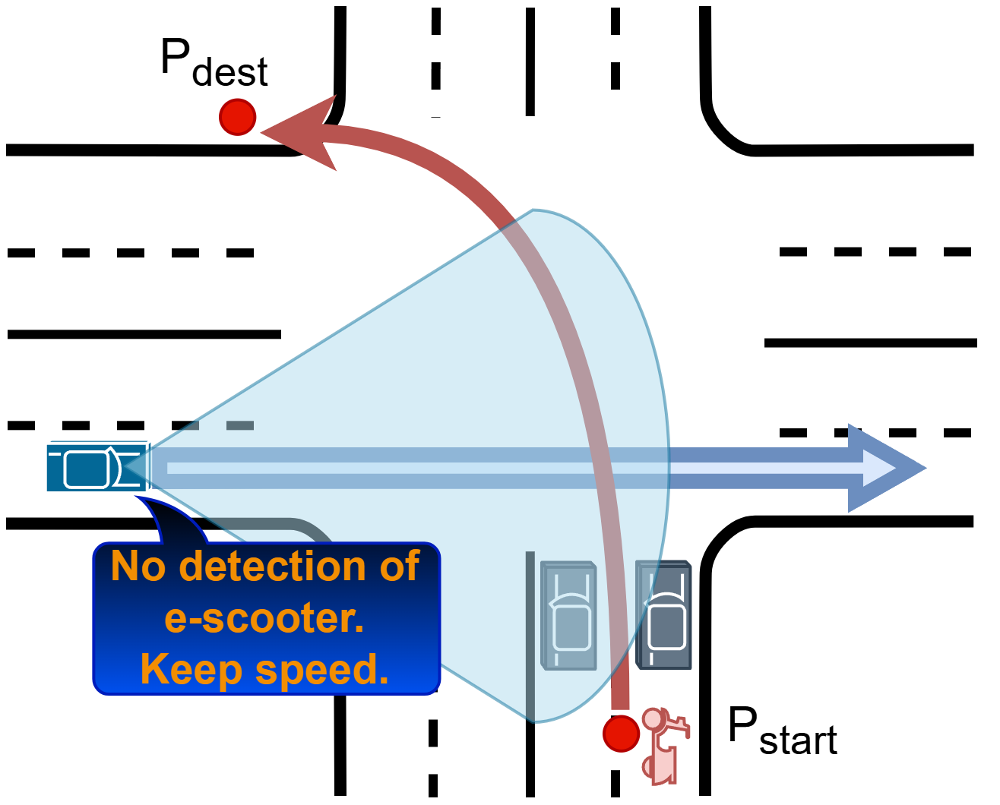
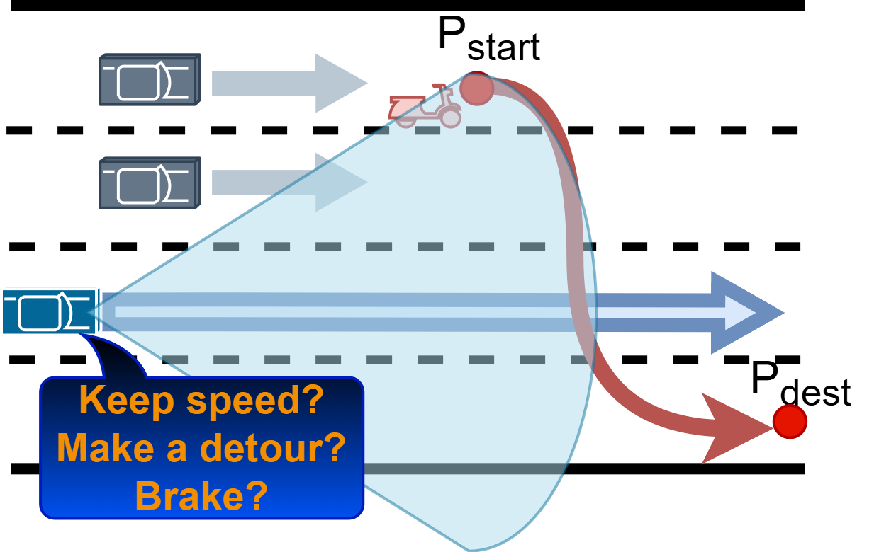

# Stackelberg Game Modeling and Decision-Making for Vehicle–E-Scooter Interaction (VEI)

This project demonstrates a reproducible **vehicle–e-scooter interaction (VEI)** simulation framework built around a **discrete-time Stackelberg game** and a set of collision-avoidance planners spanning:
- **Rule-based vs Optimization-based**
- **Longitudinal-only (1D) vs Coupled longitudinal–lateral (2D)**

> Paper: *Stackelberg Game Modeling and Decision-Making for Vehicle-E-Scooter Interaction* (in Proc. 2026 International Conference on Intelligent Transportation Systems (ITSC 2026), accepted, Naples, Italy, September 2026.)

---

## Highlights
- **Game-based VEI**: ego vehicle as leader, e-scooter as type-conditioned follower.
- **Bounded perception**: detection gate to mimic late/partial awareness.
- **Four planners**: Rule1D, Rule2D, MPC1D, MPC2D.
- **MPC2D**: hierarchical “contract selection + contract-constrained execution” with safety overrides.

---

## Framework Overview

The workflow follows a three-stage loop: scenario identification → game-based simulation modeling → quantitative + qualitative evaluation.

---

## Interaction Model (Stackelberg)

At each step, the ego selects an action; the rider responds via a one-step best response under a latent rider type (e.g., Aggressive vs Normal). The leader can be belief-aware, and replans in a receding horizon.

---

## Planners

### Rule-based baselines
- **Rule1D**: finite-state logic (cruise/brake) using predicted TTC as a safety gate.
- **Rule2D**: adds a lightweight minimum-risk lateral reference selector before committing to braking.

### Optimization-based planners
- **MPC1D**: belief-weighted Stackelberg evaluation over candidate accelerations.
- **MPC2D (proposed)**: two-layer hierarchy:
    1. **Strategic contract selection** (KEEP / YIELD / DETOUR\_LEFT / DETOUR\_RIGHT)
    2. **Tactical execution** under hard corridor + speed-envelope constraints
    3. **Safety overrides** if execution becomes infeasible

---

## Scenarios

### 1) E-scooter intersection crossing

### 2) E-scooter straight-road lane change (cut-in)

---

## Results (summary)

| Scenario | Controller | Collision rate (%) | Safety score |
|---|---:|---:|---:|
| Intersection | Rule1D | 11.6 | 0.884 |
|  | Rule2D | 5.8 | 0.942 |
|  | MPC1D | 3.2 | 0.968 |
|  | **MPC2D** | **0.4** | **0.996** |
| Straight road | Rule1D | 10.4 | 0.872 |
|  | Rule2D | 4.8 | 0.909 |
|  | MPC1D | 2.4 | 0.950 |
|  | **MPC2D** | **1.2** | **0.954** |

---

## Qualitative Example Screenshots

Qualitative comparison (intersection crossing, aggressive rider). All rows start from the same initial conditions and use the same onboard detection timing.

- **Row 1:** **Rule1D** (longitudinal FSM).  
- **Row 2:** **Rule2D** (coupled lon–lat FSM with minimum-risk path selection).  
- **Row 3:** **MPC1D** (receding-horizon Stackelberg, longitudinal only).  
- **Row 4:** **MPC2D** (two-layer, contract-based hierarchical planner).

The colored trajectory tail indicates recent risk level (green: low, yellow: medium, red: critical).

---

## Simulation Videos

### Intersection — controller comparison
#### Rule1D — Longitudinal FSM baseline
Conservative cruise/brake logic with TTC-based safety gating.

<video controls width="100%">
  <source src="assets/videos/rule1d_simulation_video.mp4" type="video/mp4">
  Your browser does not support the video tag.
</video>

#### Rule2D — FSM with minimum-risk lateral path
Adds lightweight lane-level detour selection to reduce conflict risk.

<video controls width="100%">
  <source src="assets/videos/rule2d_simulation_video.mp4" type="video/mp4">
  Your browser does not support the video tag.
</video>

#### MPC1D — Receding-horizon Stackelberg (longitudinal-only)
Belief-weighted game evaluation over candidate accelerations.

<video controls width="100%">
  <source src="assets/videos/mpc1d_simulation_video.mp4" type="video/mp4">
  Your browser does not support the video tag.
</video>

#### MPC2D — Contract-based hierarchical planning (proposed)
Selects a strategic contract and executes within corridor constraints with safety overrides.

<video controls width="100%">
  <source src="assets/videos/mpc2d_simulation_video.mp4" type="video/mp4">
  Your browser does not support the video tag.
</video>

---
